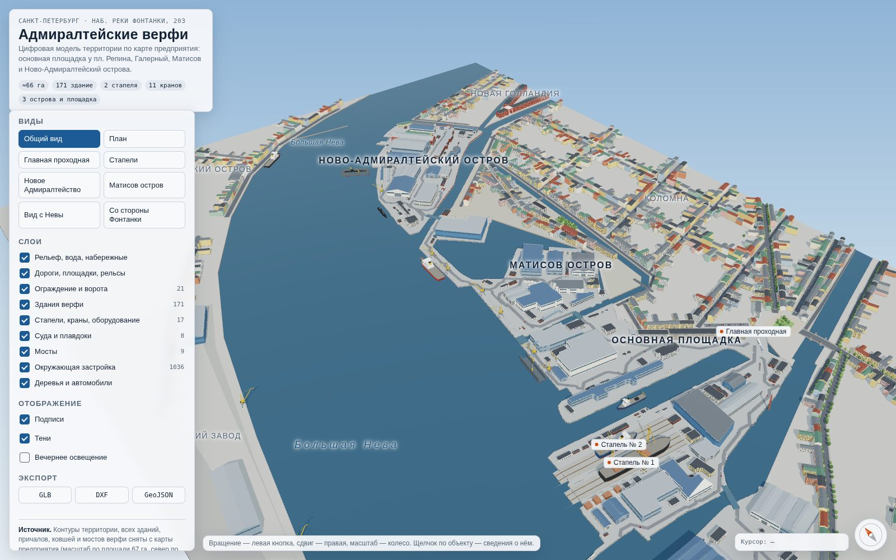
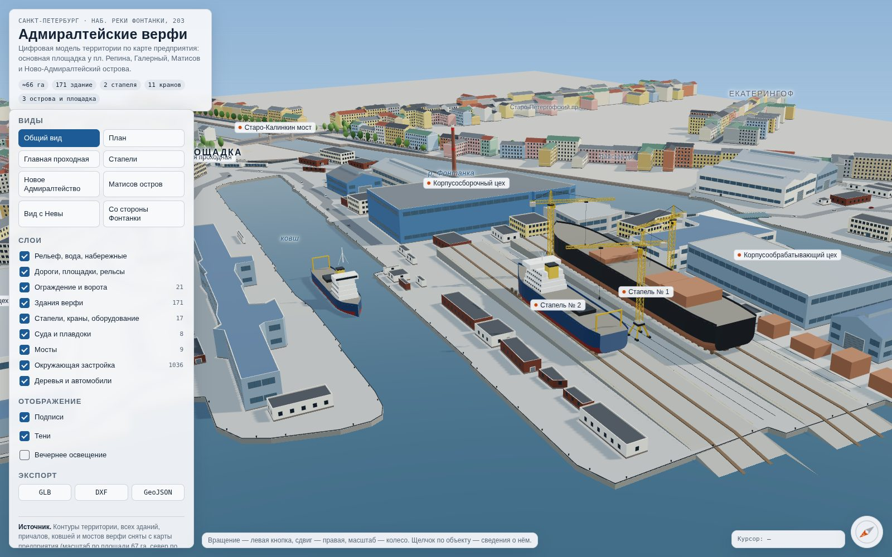
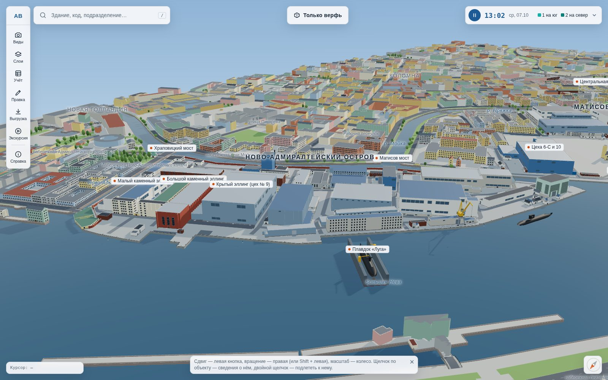
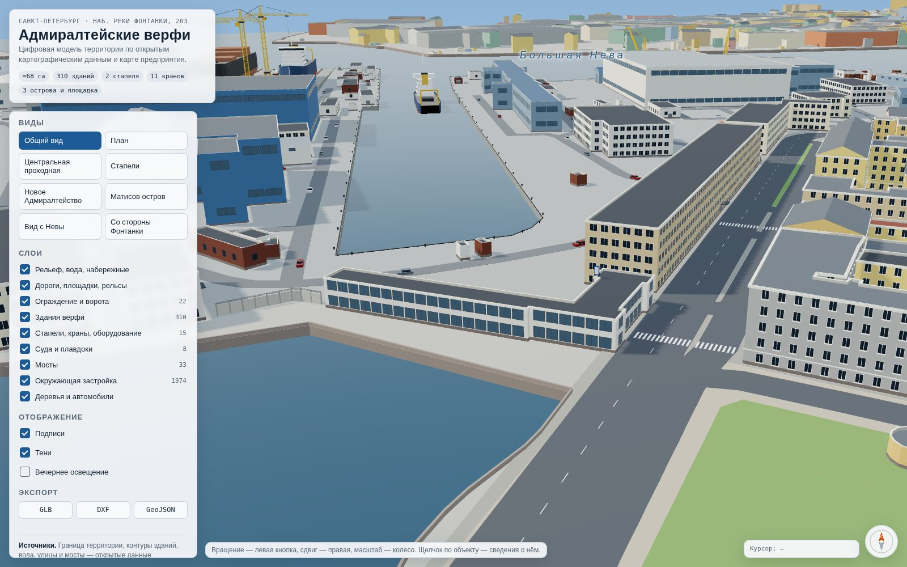
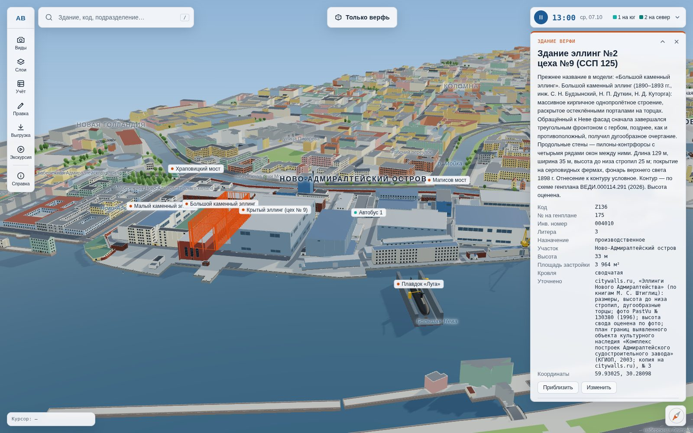
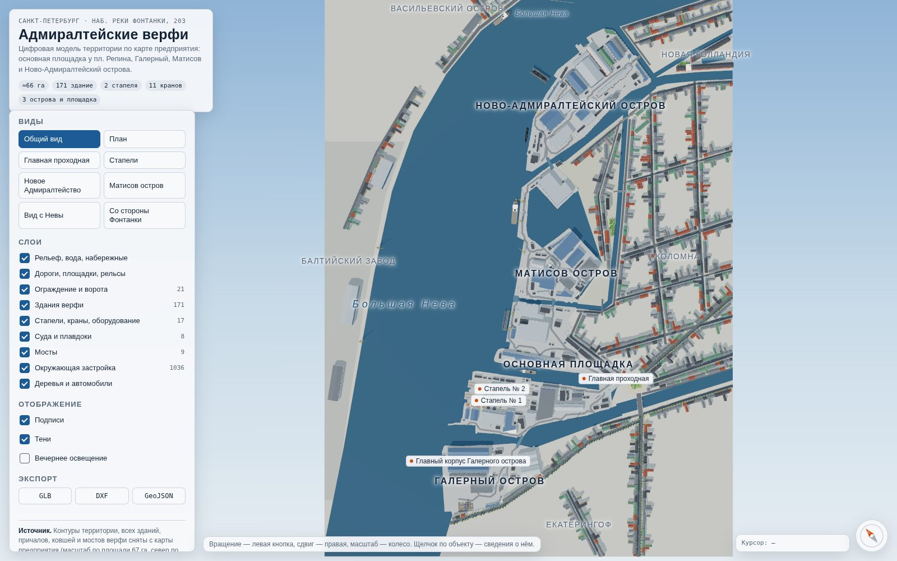
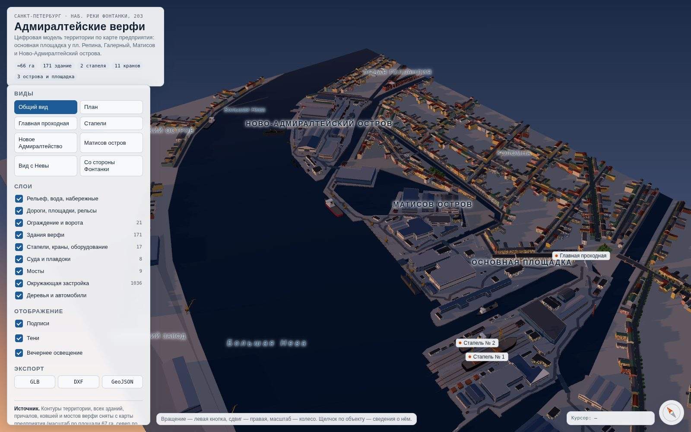
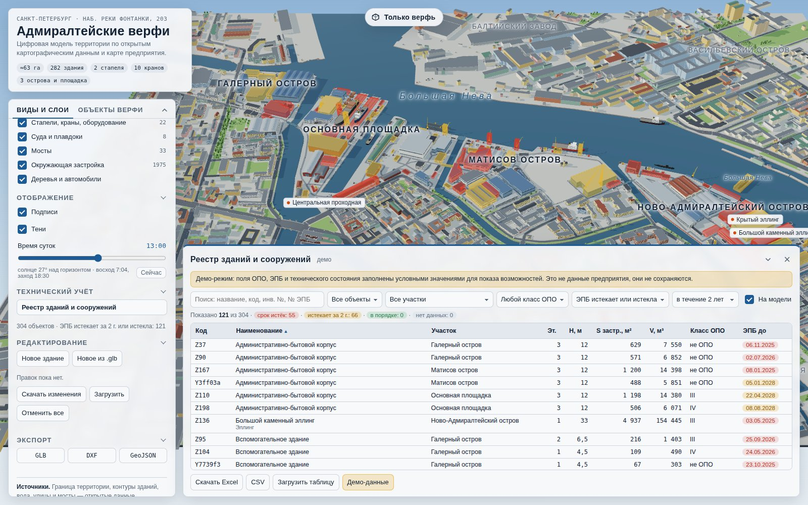

# Адмиралтейские верфи — территория

Цифровая 3D-модель территории АО «Адмиралтейские верфи» (Санкт-Петербург, наб. реки Фонтанки, 203) с ближайшим окружением.

**Геометрия реальная.** Граница территории (67,7 га), контуры и этажность зданий, вода, улицы, мосты и причалы взяты из открытых картографических данных OpenStreetMap и Microsoft ML Buildings (через Overture Maps) и совпадают с тем, что видно на спутниковых картах. С карты предприятия (`data/source/enterprise-map.png`), точно совмещённой с реальной границей, взяты назначение цехов, стапели, подкрановые пути, краны и корпуса, которых нет в открытых данных.

Верфь занимает четыре участка: основную площадку между Фонтанкой и Пряжкой (стапели, ковш, центральная проходная у площади Репина), Галерный остров в устье Фонтанки, западную часть Матисова острова и Ново-Адмиралтейский остров. Вокруг — Большая Нева, Фонтанка, Пряжка, Мойка, Ново-Адмиралтейский и Адмиралтейский каналы, Коломна, Новая Голландия и противоположный берег Васильевского острова с Балтийским заводом.



## Что в модели

| Слой | Состав |
|---|---|
| Рельеф и вода | Реальные берега Невы, Фонтанки, Пряжки, Мойки и каналов, ковши верфи, причалы; гранитные набережные с парапетами, бетонные причальные стенки с кнехтами |
| Здания верфи (310) | Реальные контуры из OpenStreetMap и Microsoft ML Buildings. Где OSM рисует комплекс одним контуром (эллинги Нового Адмиралтейства, корпуса основной площадки), он разделён на корпуса по карте предприятия; корпуса, которых нет в открытых данных, добавлены с карты. Названы центральная проходная с вывеской, заводоуправление, корпусосборочный, корпусообрабатывающий и сборочно-сварочный цеха, Большой и Малый каменные эллинги, крытый эллинг; остальные — цеха, склады, бытовые и вспомогательные корпуса |
| Стапели и краны | 2 открытых наклонных стапеля (по карте), 3 башенных стапельных крана, 7 портальных кранов на подкрановых путях причалов, козловой кран, дымовая труба, металлопрокат, секции корпуса, контейнеры |
| Суда и доки | Корпус танкера и траулер на стапелях, траулер и ледокол у достроечных набережных, подводные лодки, плавдоки «Луга» (92×27 м) и СПД-2М (92×22 м) |
| Ограждение | Строится по реальной границе территории: ж/б забор там, где снаружи город (Лоцманская ул., Рижский пр., жилая часть Матисова о.), сетчатое ограждение по кромке Фонтанки и Пряжки, кирпичная ограда Нового Адмиралтейства по Мойке и каналу. На Неве и в ковшах ограды нет — там причальный фронт; где стена цеха стоит на границе, она сама служит оградой. 11 ворот и шлагбаумов — в реальных местах из OSM (Центральные транспортные ворота, Южная и Северная проходные) |
| Дороги | Реальная уличная сеть с тротуарами и разметкой, пешеходные переходы в реальных местах, 64 внутризаводских проезда из OSM, подкрановые пути |
| Мосты | 33 моста в реальных створах: Старо-Калинкин с башнями, Галерный, Матисов, Бердов, Храповицкий, Банный и другие, плюс заводские мосты |
| Окружение | Около 2000 реальных зданий Коломны, Матисова острова, Новой Голландии, Екатерингофа и Васильевского острова с этажностью из OSM, дворы-колодцы, скверы и газоны, ледокол «Красин» на своём месте у наб. Лейтенанта Шмидта |

Детализация средняя: у зданий есть окна по этажам, двери, ворота цехов, козырьки, карнизы, цоколи, кровли (плоские с парапетом, двускатные, вальмовые, многопролётные со световыми фонарями). Дома дальше 150 м от верфи показаны упрощённо, без окон.

| Стапели | Новое Адмиралтейство |
|---|---|
|  |  |
| **Центральная проходная** | **Сведения об объекте по щелчку** |
|  |  |
| **План** | **Вечернее освещение** |
|  |  |

## Как открыть

**Просмотрщик.** Откройте `dist/index.html` в браузере (Chrome, Edge, Firefox, Safari). Сервер и интернет не нужны: three.js и данные встроены в файл. Модель строится в браузере за 1–2 секунды.

- левая кнопка мыши — вращение, правая — сдвиг, колесо — масштаб (к курсору);
- щелчок по зданию, крану, судну, мосту или забору открывает карточку: назначение, размеры, высота, этажность, площадь застройки, координаты; двойной щелчок (на телефоне — двойное касание) подлетает к объекту;
- вкладка «Объекты верфи» в левой панели — список всех 337 зданий, сооружений, кранов и судов предприятия по участкам, крупные сверху. Поиск по названию, коду (`Z129`) или подразделению, отбор по типу: цеха и эллинги, административные, склады, вспомогательные, стапели и краны, суда. Щелчок по строке — подлёт к объекту и его карточка. Переключатель «Подразделения» показывает службы, отделы и бюро с их зданиями (кто размещается, кто отвечает), ищет по названию подразделения и по ответственному, а кнопка «Показать на модели» подсвечивает все здания подразделения;
- кнопка «Изменить» в карточке и блок «Редактирование» в левой панели — редактор зданий (см. раздел «Редактор на сайте»);
- левую панель, карточку объекта и реестр можно свернуть стрелкой в их заголовке: панель — до строки с вкладками, карточку — до названия, реестр — до заголовка. Свёрнутая левая панель запоминается;
- кнопки «Виды»: общий вид, план, центральная проходная, стапели, Новое Адмиралтейство, Матисов остров, вид с Невы, со стороны Фонтанки; вид можно открыть по ссылке `index.html#slipways`;
- кнопка «Только верфь» вверху экрана (и галочка «Только территория верфи» в «Отображении») скрывает город вокруг: жилые кварталы, улицы, городские мосты, деревья и машины, подписи районов и улиц. Остаются территория предприятия, забор, цеха, стапели, краны, суда, заводские мосты и вода. Выбор запоминается в браузере, а сразу в этом режиме модель открывается по ссылке `index.html#yard`;
- «Слои» включают и выключают группы объектов, «Вечернее освещение» зажигает окна;
- внизу справа — координаты курсора (WGS84 и локальные метры) и компас (щелчок — повернуть на север).

**Файлы для CAD и ГИС** лежат в `dist/`. Их же можно выгрузить кнопками «Экспорт» в просмотрщике.

| Файл | Формат | Чем открыть |
|---|---|---|
| `admiralty-shipyards.glb` | glTF 2.0, ≈29 МБ, 2371 объект в 9 слоях, материалы с русскими названиями, у объектов есть свойства (`extras`: id, назначение, высота, размеры) | Blender, 3ds Max, SketchUp (через плагин), Unreal/Unity, Windows 3D Viewer, онлайн-просмотрщики glTF |
| `admiralty-shipyards-plan.dxf` | DXF R12, метры, 19 слоёв (`BUILDINGS_SHIPYARD`, `FENCE`, `ROADS_CITY`, `SLIPWAYS`…). Контуры зданий — замкнутые полилинии с высотой (thickness), в 3D-виде это объёмы | AutoCAD, nanoCAD, КОМПАС-3D, BricsCAD, LibreCAD |
| `admiralty-shipyards.geojson` | GeoJSON, WGS84 | QGIS, geojson.io, JOSM, Яндекс/Google-карты (импорт слоя) |
| `admiralty-shipyards-registry.xlsx` | Excel: реестр 331 объекта с расчётными показателями и пустыми полями ОПО/ЭПБ — шаблон для заполнения | Excel, LibreOffice, «МойОфис» |

GLB с окнами у всей ближней застройки (около 50 МБ) собирается командой `npm run export -- --full`, а только верфь без города — `npm run export -- --no-context`.

## Реестр зданий и сооружений (технический учёт)



Кнопка «Реестр зданий и сооружений» в левой панели открывает таблицу всех 331 объекта верфи: здания, стапели, краны, плавдоки, заводские мосты, дымовая труба.

**Что считается по модели:** этажность (из OSM; для цехов без данных — 1, для остальных — по высоте), высота, площадь застройки (за вычетом дворов), общая площадь (застройка × этажность) и строительный объём (застройка × высоту до средней отметки кровли). Где высота оценена, это отмечено.

**Что заполняет служба эксплуатации** (в открытых источниках этого нет): инвентарный №, год постройки, класс опасности ОПО (I–IV или «не ОПО»), рег. № ОПО, № и дата заключения ЭПБ, срок безопасной эксплуатации, техническое состояние и дата обследования, наличие исполнительной документации, примечание. Заполнить можно двумя способами:

- в карточке объекта — кнопка «Заполнить данные»;
- загрузить Excel или CSV: возьмите шаблон `dist/admiralty-shipyards-registry.xlsx` или выгрузку из реестра, впишите данные и загрузите кнопкой «Загрузить таблицу». Строки сопоставляются по столбцу «Код в модели».

**Отбор:** поиск по названию, коду, инвентарному № и № заключения; вид объекта, участок, класс ОПО; срок ЭПБ — «истекает или истекла», «истекает», «истёк», «в порядке», «нет данных» — с горизонтом 1, 2, 3 или 5 лет. Отобранные объекты подсвечиваются на модели по статусу: красный — срок истёк, жёлтый — истекает, зелёный — в порядке, серый — нет данных. Щелчок по строке приближает объект и открывает его карточку.

**Выгрузка:** «Скачать Excel» — отобранный список со всеми полями, включая подразделения из карточки здания («Подразделения в здании», «Отвечает за здание»). В книге два листа: реестр (статус ЭПБ залит цветом, шапка закреплена, автофильтр) и справка (как считались показатели, условия отбора). Есть и CSV.

**Где хранятся данные.** На опубликованной странице — в её общей базе: правки видны всем, кому владелец открыл доступ. Править могут участники с уровнем «Участник» (Contributor) и выше, у «Читателей» реестр только для просмотра. В локальном файле `dist/index.html` данные хранятся в этом браузере; обмениваться ими можно через Excel.

**Демо-данные** — кнопка для показа возможностей. Она заполняет поля условными значениями: на экране это обозначено плашкой, значения не сохраняются, а в выгрузке помечены «ДЕМО».

> Сведения об ОПО и экспертизах — внутренние данные предприятия. Страница по умолчанию открывается только у владельца, круг доступа он задаёт сам.

## Редактор на сайте

Кнопка «Изменить» в карточке объекта открывает форму правки:

- **сведения** — название, тип, этажность, высота, отделка фасада, форма и высота кровли, описание и «Уточнено по» — откуда взяты сведения (фото, обмер, документ); источник показывается в карточке;
- **подразделения** — кто размещается в здании и кто за него отвечает, с ответственным (ФИО, телефон). Подразделений может быть несколько; здание может пустовать и при этом числиться за бюро или службой — тогда в карточке написано «Здание не занято». Названия подсказываются из уже введённых, чтобы одна служба не писалась по-разному;
- **положение** — координаты центра X (на восток) и Y (на север) в метрах, поворот в градусах; стрелки на форме и на клавиатуре сдвигают здание относительно экрана («вверх» — от камеры), Shift — шаг ×10, Q и E — поворот; кнопка «Указать центр на карте» ставит здание в точку щелчка;
- **модель** — «Заменить моделью .glb» подставляет модель из Blender (если она построена не на своём месте, её можно поставить координатами), «Вернуть модель по данным» возвращает исходную геометрию;
- **удаление** — «Удалить» (нажать дважды для подтверждения); «Вернуть как было до правок на сайте» отменяет правки объекта.

В блоке «Редактирование» левой панели: «Новое здание» (коробка 30 × 18 м в центре экрана — размеры, тип, высоту и место задайте в форме), «Новое из .glb», «Скачать изменения», «Загрузить» и «Отменить все». Esc отменяет правку, Enter сохраняет. Пока идёт правка, здание показывается так, как будет после сохранения.

**Где хранятся правки.** В опубликованной на claude.ai версии — в общей базе страницы: правки видят все, кому открыт доступ, а вносить их могут только те, у кого есть право на запись; модели .glb хранятся там же, частями. В локальном файле `dist/index.html` — в этом браузере. Чтобы правки вошли в модель насовсем (и в выгрузки GLB, DXF, GeoJSON, на портал), нажмите «Скачать изменения»: архив содержит `custom.json` и модели `.glb`. Распакуйте его в папку `custom/` с заменой файлов и выполните `npm run build`. После этого правки в браузере можно отменить — они уже в модели.

> Подразделения и ответственные — внутренние сведения предприятия. Они попадают в `custom.json`, поэтому держите репозиторий закрытым или не переносите эти записи в него.

## Доработка модели в Blender: замена, удаление, новые здания

Сайт строит модель кодом из данных, поэтому правки внутри `dist/admiralty-shipyards.glb` на сайт не попадают, а следующая выгрузка их перезапишет. Доработки кладутся в папку `custom/`. Их учитывают сайт, выгрузки GLB, DXF и GeoJSON, реестр и проверка модели.

| Что нужно | Что положить в `custom/` |
|---|---|
| Заменить здание своей моделью (развёртка, текстуры, детали) | `<код>.glb` — модель этого здания из Blender |
| Поставить новое здание | `<новый код>.glb` и описание в `custom.json` |
| Удалить здание, кран, судно, мост, участок забора | код в списке `remove` в `custom.json` |
| Переименовать или поменять описание без правки геометрии | запись в `buildings` в `custom.json` |

**Код объекта** виден в карточке (строка «Код»), во вкладке «Объекты верфи» и в реестре. В Blender имя объекта начинается с кода: «Z129 Корпусосборочный цех…». Длинные имена Blender обрезает, но код остаётся.

### Заменить здание своей моделью

1. Откройте `dist/admiralty-shipyards.glb` в Blender: File → Import → glTF 2.0.
2. Доработайте здание: развёртка, материалы, текстуры, детали. Само здание не сдвигайте, оно должно остаться на своём месте.
3. Выделите только это здание (если частей несколько — все его части) и экспортируйте: File → Export → glTF 2.0:
   - Format — glTF Binary (.glb);
   - Include → Limit to — Selected Objects;
   - Transform — +Y Up (включено по умолчанию);
   - Data → Mesh — Apply Modifiers;
   - Material → Images — JPEG, текстуры не больше 2048 пикселей;
   - Compression не включайте: сжатая геометрия (Draco) на сайте не откроется.
4. Сохраните файл как `custom/Z129.glb`: имя файла — код здания. Можно оставить и название через пробел: `Z129 Корпусосборочный цех.glb`.

Карточка, поиск, реестр и подлёт работают как прежде. Сведения о здании сохраняются, высота берётся из вашей модели, а в карточке появляется строка «Модель: из Blender».

### Поставить новое здание

1. Смоделируйте здание в той же сцене, на его месте. Оси Blender совпадают с осями модели: X — метры на восток, Y — на север от центра площади Репина, Z — высота. Нужную точку можно взять в просмотрщике: внизу справа показаны координаты курсора x и y.
2. Назовите объект новым кодом, которого нет в модели, например `N1`, и экспортируйте так же, в `custom/N1.glb`.
3. Опишите здание в `custom/custom.json`:

```json
{
  "remove": [],
  "buildings": {
    "N1": { "name": "Склад готовой продукции", "type": "warehouse", "info": "Построен в 2027 г.", "floors": 1 }
  }
}
```

Здание внутри границы верфи попадает в «Здания верфи», в список объектов и в реестр, за границей — в окружающую застройку. Без записи в `custom.json` оно появится как «Новое здание N1» с типом «вспомогательное».

Поля записи в `buildings` (их же записывает редактор на сайте):

- `name` — название;
- `type` — тип: `hall` (цех), `elling` (эллинг), `warehouse` (склад), `office` (АБК), `checkpoint` (проходная), `utility` (вспомогательное), `historic` (историческое);
- `info` — описание в карточке;
- `floors` — этажность;
- `height` — высота в метрах (для зданий, построенных по данным);
- `wall` — отделка фасада: `light`, `white`, `gray`, `panel`, `blue_gray`, `blue`, `brick`, `brick_dark`, `cream`, `yellow`, `ochre`, `sand`, `pink`, `terracotta`, `green`, `blue_stucco`;
- `roof` — форма кровли: `flat` (плоская), `gable` (двускатная), `hip` (вальмовая), `barrel` (сводчатая), `shed` (односкатная), `pyramid` (шатровая), `multigable` (многопролётная); `roofH` — высота кровли над карнизом в метрах (без неё — по ширине здания). `height` — высота до карниза, в карточке показывается высота до конька. Сводчатая, односкатная и многопролётная строятся над прямоугольным контуром; двускатная и вальмовая над контуром сложной формы — скатами по всему контуру;
- `src` — откуда уточнено (фото, обмер, документ); показывается в карточке строкой «Уточнено»;
- `move` — сдвиг `[x, y]` в метрах, `rotate` — поворот в градусах против часовой стрелки вокруг центра здания;
- `box` — новое здание без модели: `{ "x": …, "y": …, "length": 30, "width": 18, "angle": 0 }`, кровля и проёмы — по типу;
- `units` — подразделения: `[{ "name": "Отдел главного механика", "role": "occupant", "person": "Иванов И. И., тел. 12-34" }]`, `role` — `occupant` (размещается) или `owner` (отвечает за здание).

Те же поля работают и для существующих объектов: так здание можно переименовать, передвинуть или изменить без Blender.

### Удалить

Впишите коды в список `remove`:

```json
{ "remove": ["Y707ec3", "C2"], "buildings": {} }
```

Удалить можно здания, краны, суда, плавдоки, стапели (вместе с судном на стапеле), мосты и участки забора. Объект пропадает с сайта, из выгрузок GLB, DXF и GeoJSON и из реестра.

### Применить

```bash
npm run check    # что применилось и нет ли ошибок в custom.json
npm run build    # сайт: dist/index.html
npm run export   # файлы: GLB (с вашими моделями и текстурами), DXF, GeoJSON, реестр
```

`npm run check` перечислит заменённые, добавленные и удалённые объекты. Он предупредит о коде, которого нет в модели, об ошибке в записи `custom.json` и о новом здании, которое пересекается с соседними. Для сборки нужен Node.js 18 или новее; один раз выполните `npm install` в папке проекта. Модели из `custom/` встраиваются в страницу: каждый мегабайт GLB добавляет к ней около 1,3 МБ.

## Система координат

Модель построена в локальной метрической системе: **x — на восток, y — на север, z — вверх**. Начало координат — центр площади Репина (59.91694° с. ш., 30.27948° в. д.). Перевод в WGS84 выполняют функции `toLatLon` и `fromLatLon` в `src/geo.js`. Уровень земли 0 м, вода −2,4 м. В three.js и GLB ось Y направлена вверх, а север соответствует −Z.

## Откуда геометрия и насколько она точна

**Реальная геометрия — Overture Maps.** Скрипт `tools/overture_fetch.py` читает открытые данные [Overture Maps](https://overturemaps.org) (GeoParquet в открытом хранилище, выпуск 2026-09-23) только для прямоугольника вокруг верфи и переводит их в метры модели → `src/data/real-data.js`. В этих данных:

- граница территории «Адмиралтейские верфи» из OpenStreetMap — 67,7 га (официально 67 га);
- 2574 здания: контуры OpenStreetMap и Microsoft ML Buildings (распознаны по космоснимкам), у 1220 есть этажность или высота;
- вода, улицы, внутризаводские проезды, пешеходные переходы, мосты, причалы, скверы, ворота.

Модуль `src/data/real.js` собирает из этого модель. Здания на плаву (дебаркадеры) и контуры, распознанные на стапелях (это суда), отбрасываются.

**Карта предприятия.** `tools/trace_map.py` оцифровывает карту (участки, 201 контур построек), а `tools/register_map.py` совмещает её с реальной границей территории: подбирает преобразование «пиксель → метры» по контурам участков. Совпадение площадей 89 %, медианное отклонение контура около 3 м, масштаб 1,502 м/пикс. Раньше карта была повёрнута по нарисованной стрелке севера, и это давало ошибку в 100–200 м; теперь её положение задаёт реальная граница. С карты берутся:

- назначение цехов: каждому реальному контуру подбирается совпадающий корпус карты (поле `NAMED` в `src/data/shipyard.js`);
- разбиение объединённых контуров OSM на корпуса и корпуса, которых нет в открытых данных (в карточке так и написано);
- стапели, подкрановые пути, краны, суда и плавдоки.

**Высоты.** Для городских домов этажность и высоты взяты из OpenStreetMap; где их нет, принято 5 этажей для жилых домов и типовые значения для остальных. **У зданий верфи высот в открытых данных нет.** Цеха оценены по пролёту, как у типовых промзданий: пролёт 18 м — около 15 м, 24 м — 18 м, 30 м и шире — 21–24 м. Эллинги — выше, по ширине. Такие здания помечены в карточке «Положение условное», в описании указано «Высота оценена». Если есть реальные высоты, их можно вписать в `NAMED` (`h`) или в `custom/custom.json`.

**Уточнения по фотографиям и описаниям.** Часть зданий верфи сверена с открытыми фотографиями (Wikimedia Commons, PastVu) и описаниями памятников; правки лежат в `custom/custom.json` с полем `src`, источник виден в карточке («Уточнено»):

- Z136, Большой каменный эллинг — сводчатое покрытие, кирпичные стены, высота до низа стропил 23,5 м (фото PastVu № 130380, описание 1890–1893 гг.); высота свода оценена по фото;
- Z153, Малый каменный эллинг — высота 21,6 м, двускатная кровля с фронтоном (описание 1833–1838 гг.);
- Z160, Главное корабельное здание — опознано по фото Wikimedia Commons: четыре этажа, скатная кровля, светлый фасад.

Остальные высоты верфи по-прежнему оценены: в открытых фотографиях здания редко удаётся надёжно сопоставить с контуром. Точнее всего — вписать высоты по технической документации (паспорта зданий) в редакторе или в `custom.json`.

Обновить данные: `python3 tools/overture_fetch.py --refresh` (нужны `pyarrow`, `shapely`, `requests`), затем `python3 tools/register_map.py`, если поменялась граница территории, и `npm run check`.

### Свежая выгрузка напрямую из OpenStreetMap

Данные Overture обновляются раз в месяц. Чтобы взять самое свежее состояние OSM напрямую:

```bash
npm install
npm run osm:fetch      # скачать здания, воду, улицы, заборы в границах модели (Overpass API)
npm run build && npm run export
```

Скрипт сохраняет ответ в `data/osm/raw.json` и собирает слой уточнения `src/data/osm-overlay.js`. После этого:

- контуры и высоты зданий, вода, улицы и ограждения берутся из OSM;
- названия и описания цехов с карты предприятия переносятся на совпавшие OSM-контуры;
- стапели, краны, суда, доки и мосты остаются прежними.

Вернуться к данным Overture: `npm run osm:convert -- --reset`.

> В облачном окружении, где собиралась модель, доступ к `overpass-api.de` закрыт сетевой политикой. Для импорта нужен обычный интернет или разрешённый домен `overpass-api.de` (другой сервер задаётся через `OVERPASS_URL`).

### Поправить данные вручную

- `src/data/shipyard.js` — назначение, высоты и оформление корпусов (`NAMED`, по номеру контура на карте), стапели, краны, суда, доки, площадки;
- `src/data/real.js` — правила сборки из открытых данных: оценка высот, типы зданий, мосты, ворота;
- `src/data/index.js` — подписи районов и водоёмов;
- `tools/overture_fetch.py`, `tools/register_map.py`, `tools/trace_map.py` — загрузка открытых данных, привязка и оцифровка карты.

Точку карты предприятия в метры переводит `px(xПикс, yПикс)` из `src/data/mapdata.js`; координаты WGS84 — `fromLatLon(lat, lon)` из `src/geo.js`.

После правок выполните `npm run check`: скрипт найдёт здания в воде, на проезжей и внутризаводских проездах и пересечения зданий.

## Команды

```bash
npm install            # зависимости: three, polygon-clipping, esbuild
npm run dev            # пересборка при изменениях + сервер http://localhost:8080
npm run build          # dist/index.html (+ dist/artifact.html для публикации)
npm run export         # dist/*.glb, *.dxf, *.geojson
npm run check          # проверка данных и статистика модели
npm test               # тест конвейера OSM на синтетических данных + проверка данных
npm run screenshots    # снимки всех видов в docs/img (нужен Playwright)
node promo/shots.mjs   # снимки для документа ППУ в promo/img (нужен Playwright)
node promo/build-pdf.mjs   # PDF «Предложение по улучшению» из promo/ppu.html

python3 tools/overture_fetch.py   # открытые данные Overture Maps → src/data/real-data.js
python3 tools/register_map.py     # привязка карты предприятия к реальной границе
python3 tools/trace_map.py        # оцифровка карты предприятия → src/data/map-trace.js
```

## Устройство проекта

```
src/
  geo.js              система координат, геометрия на плоскости
  data/               real-data.js (открытые данные), real.js (сборка из них), mapdata.js и
                      map-trace.js (карта предприятия и её привязка), shipyard.js (назначение
                      цехов, стапели, краны, суда), index.js (полный набор данных), слой OSM
  model/              генерация 3D: рельеф и вода (булевы операции), дороги, здания с окнами
                      и дворами, ограда (автоматически по контуру), краны, суда и доки, мосты
  export/             DXF R12, GeoJSON, склейка GLB с моделями из custom/
  registry/           реестр зданий и сооружений: состав, расчётные показатели, поля ЭПБ/ОПО,
                      запись и чтение .xlsx без сторонних библиотек
  osm/convert.js      преобразование ответа Overpass в слой уточнения
  viewer/             интерфейс просмотрщика (three.js, OrbitControls, подписи CSS2D)
tools/                загрузка Overture Maps, привязка и оцифровка карты предприятия (Python)
data/source/          карта предприятия
data/overture/       кэш выборки Overture Maps (не хранится в git)
scripts/              сборка, экспорт, проверка, импорт OSM, снимки экрана
test/                 синтетический ответ Overpass, модели из Blender для теста custom/, тесты
custom/               доработки вручную: модели из Blender (*.glb) и custom.json (удаление, новые здания)
dist/                 готовые файлы
promo/                предложение по улучшению (ППУ): PDF, исходник ppu.html, снимки, шрифты
```

Модель полностью процедурная: один и тот же код строит сцену в браузере и в Node (для экспорта). Генерация детерминирована, поэтому при каждой сборке получается одна и та же застройка.

## Источники

- **Открытые картографические данные:** [Overture Maps Foundation](https://overturemaps.org), выпуск 2026-09-23 — © участники [OpenStreetMap](https://www.openstreetmap.org/copyright), Microsoft ML Buildings; лицензия ODbL. Граница территории, здания, этажность, вода, улицы, мосты, ворота
- **Карта предприятия** (предоставлена заказчиком) — назначение цехов, стапели, корпуса, которых нет в открытых данных
- [Адмиралтейские верфи — Википедия](https://ru.wikipedia.org/wiki/Адмиралтейские_верфи); [Комплекс построек Адмиралтейского судостроительного завода](https://ru.wikipedia.org/wiki/Комплекс_построек_Адмиралтейского_судостроительного_завода)
- [Производственные мощности: стапели 259×35 м, крытые эллинги, плавдоки «Луга» и СПД-2М — korabel.ru](https://www.korabel.ru/shipbuilding/shipyard/admiralty_shipyards/info/2020.html)
- [Главная судостроительная мастерская с кузницей (1910), Фонтанки наб., 203 АЦ — citywalls.ru](https://www.citywalls.ru/house21038.html); [Новое Адмиралтейство, наб. Ново-Адмиралтейского канала, 3](https://www.citywalls.ru/house8261.html); [Эллинги Нового Адмиралтейства](https://www.citywalls.ru/house33350.html)
- [Галерный остров: 10 га, главная проходная — kdnv.ru](https://kdnv.ru/blog/admiraltejskie-verfi-galernyj-ostro/); [Galerny Island — encspb.ru](https://www.encspb.ru/object/2803998702?lc=en): остров в устье Фонтанки, ≈10 га, после засыпки левого рукава Фонтанки в середине XX в. перестал быть островом
- Фото: [PastVu № 130380 — каменный эллинг, 1996](https://pastvu.com/p/130380); [Wikimedia Commons — Главное корабельное здание Адмиралтейского завода](https://commons.wikimedia.org/wiki/File:Главное_корабельное_здание_Адмиралтейского_завода.jpg)
- [Ново-Адмиралтейский остров, 17 га — РБК](https://www.rbc.ru/spb_sz/29/11/2025/69282c6e9a79471bd02eb6e1)
- [Матисов остров: большая часть занята верфью — «Фонтанка», 2021](https://www.fontanka.ru/2021/02/02/69744479/); [Матисов остров — Википедия](https://ru.wikipedia.org/wiki/Матисов_остров)
- [Пряжка (река) — Википедия](https://ru.wikipedia.org/wiki/Пряжка_(река)); [Лоцманская улица — РУВИКИ](https://ru.ruwiki.ru/wiki/Лоцманская_улица_(Санкт-Петербург))
- [Ново-Адмиралтейский мост — координаты створа](https://dic.academic.ru/dic.nsf/ruwiki/1319016)
- [Реконструкция достроечной набережной (275 + 295 м) — portnews.ru](https://portnews.ru/news/373086/)

Модель не является обмерным чертежом: контуры — из открытых карт и карты предприятия, высоты зданий верфи и назначение большинства корпусов оценены, сведения об объектах — из общедоступных описаний.

## Лицензии сторонних компонентов

three.js (MIT), polygon-clipping (MIT), esbuild (MIT). Картографические данные: © участники OpenStreetMap, Overture Maps Foundation, Microsoft — ODbL; при распространении модели указывайте эту атрибуцию.
